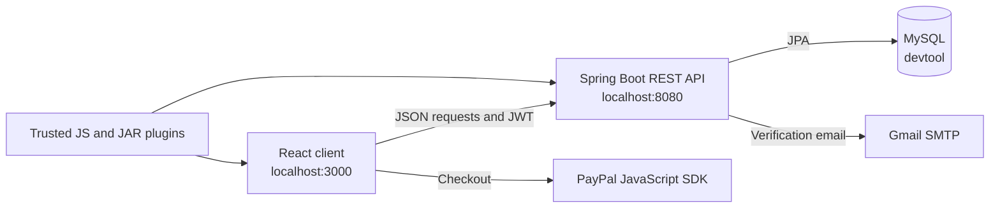

# DevToolBox

DevToolBox is a full-stack web application that collects common developer utilities in one place. It includes encoding, conversion, networking, text-processing, data, QR-code, validation, calculation, and benchmarking tools.

Visitors can use the public tools without an account. Registered users can save favorites and view recently used tools. Administrators can manage categories, tool availability, premium access, and trusted local plugins.

## Main features

- Around 30 built-in developer tools
- Searchable dashboard organized by category
- Registration, email verification, login, and JWT authentication
- Favorite and recent-tool history for signed-in users
- Premium account status and PayPal client integration
- Admin dashboard for users, categories, tools, and plugins
- Optional Java JAR plugin loading for trusted local development

## Architecture



The React frontend provides the pages and browser-side tools. Requests that require persistence, authentication, administration, or server-side processing are sent to the Spring Boot API. The API stores data in MySQL through Spring Data JPA. Protected requests include a JWT in the `Authorization: Bearer <token>` header.

### Backend layers

- `api`: REST controllers and HTTP request handling
- `application`: business logic and services
- `data`: JPA entities and repositories
- `config`: security, CORS, email, JWT, plugin, and startup configuration

### Project structure

```text
DevToolBox/
|-- README.md
|-- devtoolbox-frontend/
|   |-- public/                 Static files
|   |-- src/components/         Shared React components
|   |-- src/pages/              Application pages
|   |-- src/config/             Frontend API configuration
|   |-- src/context/            Authentication and application state
|   |-- src/plugins/            Local React plugin source files
|   |-- .env.example            Frontend environment template
|   `-- package.json
`-- devtoolbox-backend/
    |-- src/main/java/          Spring Boot application code
    |-- src/main/resources/     Application configuration
    |-- src/test/               Backend tests and test profile
    |-- local-libs/             Optional thin-JAR dependencies
    |-- .env.example            Backend environment template
    `-- pom.xml
```

## Technology

| Part | Technology |
| --- | --- |
| Frontend | React 19, React Router 6, Bootstrap 5, Create React App |
| Backend | Java 17, Spring Boot 3.4, Spring Security, Spring Data JPA |
| Database | MySQL 8 |
| Authentication | JWT with email verification |
| Build tools | npm and Maven Wrapper |

## Requirements

Install these before running the project:

- Git
- JDK 17 or later
- Node.js 18 or later with npm
- MySQL 8

You do not need to install Maven globally because the repository includes the Maven Wrapper.

Check the installed versions:

```powershell
git --version
java -version
node --version
npm --version
mysql --version
```

## Installation and local setup

### 1. Clone the repository

```powershell
git clone https://github.com/buihienn/Dev-Tool-Box.git
cd Dev-Tool-Box
```

If the repository is already on your computer, open a terminal in its root folder instead.

### 2. Create the MySQL database

Open MySQL and run:

```sql
CREATE DATABASE devtool CHARACTER SET utf8mb4 COLLATE utf8mb4_unicode_ci;
```

Spring Boot creates and updates the tables when the backend starts.

### 3. Configure and run the backend

From the repository root:

```powershell
cd devtoolbox-backend
Copy-Item .env.example .env
```

On macOS or Linux, use `cp .env.example .env` instead.

Open `.env` and set at least the database credentials and JWT secret:

```dotenv
DB_URL=jdbc:mysql://localhost:3306/devtool
DB_USERNAME=root
DB_PASSWORD=your_mysql_password

JWT_SECRET_KEY=replace_with_a_base64_encoded_secret
JWT_EXPIRATION_TIME=86400000

ADMIN_EMAIL=admin@example.com
ADMIN_PASSWORD=replace_with_at_least_12_characters

MAIL_USERNAME=your_email@gmail.com
MAIL_PASSWORD=your_gmail_app_password

SERVER_PORT=8080
CORS_ALLOWED_ORIGINS=http://localhost:3000
PLUGIN_DIRECTORY=plugins
PLUGIN_RUNTIME_LOADING_ENABLED=false
```

Generate a suitable Base64 JWT secret with Java:

```powershell
jshell
```

Then enter these two lines in JShell:

```java
import java.security.SecureRandom;
Base64.getEncoder().encodeToString(new SecureRandom().generateSeed(32));
```

Copy the generated value into `JWT_SECRET_KEY`, exit JShell, and start the API:

```powershell
./mvnw.cmd spring-boot:run
```

The backend runs at `http://localhost:8080` by default.

On macOS or Linux, use:

```bash
./mvnw spring-boot:run
```

### 4. Configure and run the frontend

Open a second terminal in the repository root:

```powershell
cd devtoolbox-frontend
Copy-Item .env.example .env.local
npm ci
npm start
```

On macOS or Linux, replace `Copy-Item` with `cp`.

The browser should open `http://localhost:3000`. Keep both the backend and frontend terminals running while using the application.

`npm ci` installs the exact frontend dependency versions recorded in `package-lock.json`. The Maven Wrapper downloads the backend dependencies automatically on its first run.

## Environment variables

### Backend

| Variable | Required | Default or purpose |
| --- | --- | --- |
| `DB_URL` | Yes | JDBC connection to the `devtool` database |
| `DB_USERNAME` | Yes | MySQL username |
| `DB_PASSWORD` | Yes | MySQL password |
| `JWT_SECRET_KEY` | Yes | Base64-encoded secret containing at least 32 random bytes |
| `JWT_EXPIRATION_TIME` | No | Token lifetime in milliseconds; default `86400000` |
| `ADMIN_EMAIL` | No | Creates the initial administrator when supplied with a valid password |
| `ADMIN_PASSWORD` | No | Initial admin password; must contain at least 12 characters |
| `MAIL_USERNAME` | For email verification | Gmail address used to send verification messages |
| `MAIL_PASSWORD` | For email verification | Gmail App Password, not the normal account password |
| `SERVER_PORT` | No | Backend port; default `8080` |
| `CORS_ALLOWED_ORIGINS` | No | Comma-separated allowed frontend origins |
| `PLUGIN_DIRECTORY` | No | Folder containing trusted JAR plugins; default `plugins` |
| `PLUGIN_RUNTIME_LOADING_ENABLED` | No | Enables runtime JAR loading; default `false` |

The administrator is created only when the configured email does not already exist. Changing `ADMIN_PASSWORD` later does not reset the password of an existing database account.

### Frontend

| Variable | Required | Default or purpose |
| --- | --- | --- |
| `REACT_APP_API_BASE_URL` | No | Backend URL; default `http://localhost:8080` |
| `REACT_APP_PAYPAL_CLIENT_ID` | For payments | PayPal application client ID |

Restart the frontend after changing `.env.local` because React reads these values when the development server starts.

## How to use the application

### Public tools

1. Open `http://localhost:3000`.
2. Search for a tool or select a category.
3. Open a tool, enter its input, and run the operation.

Most tools are available without signing in.

### User account

1. Open `/register` and create an account.
2. Use the verification link sent by the backend.
3. Sign in at `/login`.
4. Use the heart icon to save favorite tools and view recently used tools from the account area.

Email verification requires valid `MAIL_USERNAME` and `MAIL_PASSWORD` values. For Gmail, enable two-step verification and create an App Password.

### Administrator

1. Configure `ADMIN_EMAIL` and `ADMIN_PASSWORD` before the first backend startup.
2. Sign in with that account.
3. Open `/admin`.
4. Manage users, premium status, categories, tools, and trusted plugins.

Administrative API operations are protected by the `ADMIN` role.

### Premium and PayPal

Set `REACT_APP_PAYPAL_CLIENT_ID` to display the PayPal checkout on the pricing page. The current payment flow is suitable for coursework and local demonstrations. A production deployment should verify the PayPal order and payment amount on the backend before granting premium access.

## Important API groups

| Path | Purpose | Access |
| --- | --- | --- |
| `/tool/**` | Built-in developer-tool operations | Public |
| `/api/categories/all` | List categories | Public |
| `/api/doTool/getAll` | List enabled tools | Public |
| `/api/auth/**` | Registration, login, verification, and plugin invocation | Mostly public |
| `/api/user/**` | Current user and account operations | Signed-in user |
| `/api/favorite/**` | Favorite-tool operations | Signed-in user |
| `/api/admin/**` | User and premium management | Administrator |
| `/api/tools/**` | Tool-management operations | Administrator for changes |
| `/api/thin-jar/**` | Upload JAR plugin dependencies | Administrator |

## Tests and production builds

### Backend tests

Backend tests use an in-memory H2 database, so MySQL does not need to be running for this command:

```powershell
cd devtoolbox-backend
./mvnw.cmd test
```

### Frontend tests

```powershell
cd devtoolbox-frontend
npm ci
npm test -- --watchAll=false
```

### Create production packages

```powershell
cd devtoolbox-backend
./mvnw.cmd clean package
```

The backend JAR is created under `devtoolbox-backend/target`.

```powershell
cd devtoolbox-frontend
npm ci
npm run build
```

The frontend files are created under `devtoolbox-frontend/build`.

The generated `node_modules`, `build`, and `target` directories are intentionally excluded from Git. Every developer can recreate them with the commands above.

## Trusted plugin development

Runtime plugin loading is disabled by default because uploaded Java code executes inside the backend process with the application's permissions. Enable it only for trusted local development:

```dotenv
PLUGIN_RUNTIME_LOADING_ENABLED=true
PLUGIN_DIRECTORY=plugins
```

The plugin workflow supports:

- A React `.js` component copied into the frontend `src/plugins` folder
- A Java fat JAR, or a thin JAR with dependencies available locally
- Plugin Java classes under a `com.*` package
- Public methods invoked through the plugin endpoint with `className`, `methodName`, and `arg0`, `arg1`, and similar query parameters

Thin-JAR dependencies should be declared in the JAR manifest `Class-Path` and placed in `devtoolbox-backend/local-libs`. Uploaded plugins are not sandboxed, so do not enable this feature for untrusted users or a public deployment.

Because a frontend plugin is copied into the React source tree, restart or rebuild the frontend after adding one.

## Troubleshooting

### Backend cannot connect to MySQL

- Confirm that MySQL is running.
- Confirm that the `devtool` database exists.
- Check `DB_URL`, `DB_USERNAME`, and `DB_PASSWORD` in `devtoolbox-backend/.env`.

### Browser reports a CORS error

Add the exact frontend origin to `CORS_ALLOWED_ORIGINS`. Multiple origins must be separated by commas, then restart the backend.

### Registration succeeds but no email arrives

- Use a Gmail App Password in `MAIL_PASSWORD`.
- Confirm that `MAIL_USERNAME` is the same Gmail account that created the App Password.
- Check the backend terminal for the email delivery error.

### The frontend cannot reach the backend

- Confirm that the API is running on port `8080`.
- Check `REACT_APP_API_BASE_URL` in `.env.local`.
- Restart the frontend after changing the environment file.

### Dependencies were deleted

This is safe. Restore the frontend packages with:

```powershell
cd devtoolbox-frontend
npm ci
```

Backend dependencies are restored automatically the next time a Maven Wrapper command runs.

## Security notes

- Never commit `.env`, `.env.local`, passwords, JWT secrets, or Gmail App Passwords.
- Rotate any credential that was previously committed to Git history; removing it from the latest file does not remove it from older commits.
- Keep runtime plugin loading disabled unless every uploaded plugin is trusted.
- Restrict `CORS_ALLOWED_ORIGINS` to the real frontend domains in production.
- Add server-side PayPal verification before treating the payment flow as production-ready.
- The frontend currently uses Create React App. Its remaining indirect dependency advisories should be handled by a planned migration rather than `npm audit fix --force`, which can install incompatible packages.
